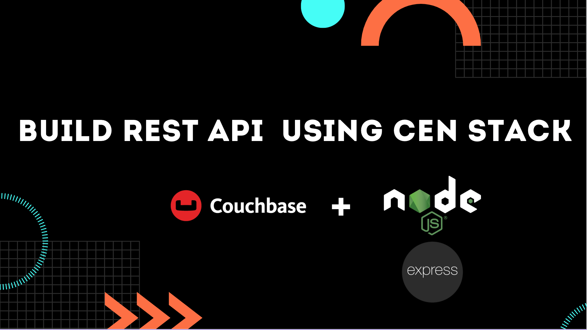

 

  <h3 align="center">Build CRUD REST API with CEN stack</h3>

  

    NodeJs, Express and Couchbase
     
    <a href="https://docs.couchbase.com/nodejs-sdk/current/hello-world/start-using-sdk.html"><strong>Explore the official docs »</strong></a>
     
  

  

<!-- ABOUT THE PROJECT -->
### About The Project
  

 
This repository contains the 6 steps that you will create while following the lab in the video above

